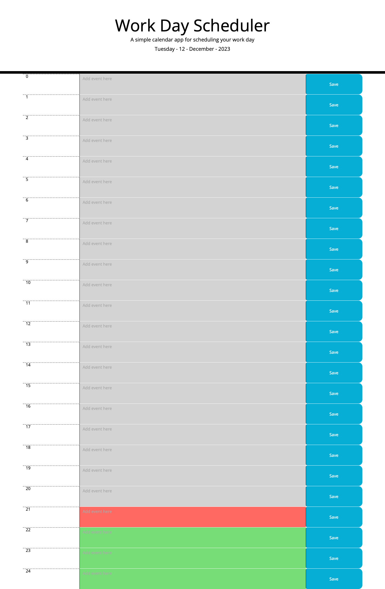

# hits-planner

## Task

Create a simple calendar application that allows a user to save events for each hour of the day by modifying starter code. This app will run in the browser and feature dynamically updated HTML and CSS powered by jQuery.

## Approach

I used the activites and help from the assistance for this task. Going over the activites and doing some extra google search helped with this task. I used external websites like stack-overflow, mdm, and chatgpt etc. These tools helped me develop the code I have so far.

## Github page-link

https://hitesh70738.github.io/hits-planner/

## Conclusion 
This weeks challenege has been difficult to attempt. The logic makes sense and certain parts click. I need to study and practice more on how to save and get localstorage items. I understand the logic but the final piece is lacking some functionality of the site.

## Screenshots 

